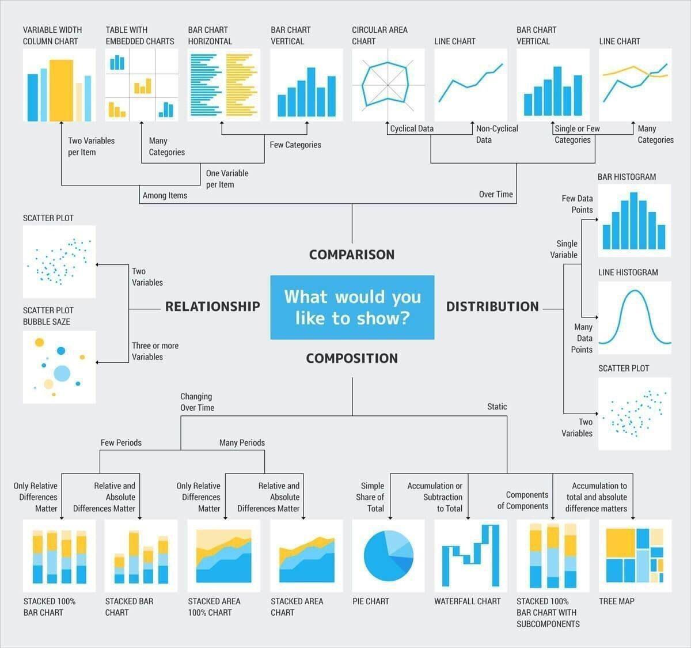

### Data Analysis:
We organized the data analysis process into five steps:
* **1. Ask questions:** Either you're given data and ask questions based on it, or you ask questions first and gather data based on that later. In both cases, great questions help you focus on relevant parts of your data and direct your analysis towards meaningful insights.
* **2. Wrangle data:** You can get the data you need in a form you can work with in three steps: gather, assess, clean. You gather the data you need to answer your questions, assess your data to identify any problems in your data’s quality or structure, and clean your data by modifying, replacing, or removing data to ensure that your dataset is of the highest quality and as well-structured as possible.
* **3. Perform EDA (Exploratory Data Analysis):** You explore and then augment your data to maximize the potential of your analyses, visualizations, and models. Exploring involves finding patterns in your data, visualizing relationships in your data, and building intuition about what you’re working with. After exploring, you can do things like remove outliers and create better features from your data, also known as feature engineering.
* **4. Draw conclusions (or even make predictions):** This step is typically approached with machine learning or inferential statistics.
* **5. Communicate your results:** You often need to justify and convey meaning in the insights you’ve found. Or, if your end goal is to build a system, you usually need to share what you’ve built, explain how you reached design decisions, and report how well it performs. There are many ways to communicate your results: reports, slide decks, blog posts, emails, presentations, or even conversations. Data visualization will always be very valuable.

### Package:
A package is a collection of modules or python files that we can import into our code. Using a short alias can help to keep your code concise and clean. Example `import numpy as np`, here `np` is conventional alias for Numpy.

 NumPy, Pandas, and Matplotlib are three core packages for data analysis. `Numpy` lets you perform mathematical functions on large multidimensional array and matrices efficiently. `Pandas` is like a more powerful and flexible version of Excel that handle large amount of data. And, `Matplotlib` is plotting library that can produce great visualization with often very few lines of code.

### CSV:
csv stands for Comma Seperated Values. Its a text file. One can read `csv` file using `pandas` as following - 
```
import pandas as pd
df = pd.read_csv('student_scores.csv')
```
There are various optins for `read_csv()` like `sep=":"` or `header=none` or `header=2` etc.
`read_csv()` loads the data into the dataframe.

### Plotting:
`seaborn` is a library to make the plot little nicer. The code as follows -
```
%pylab inline # To plot in the notebook
import seaborn as sns
```
`sns.set_style()` To set style for the background.

### Univariate VS Bivariate variables
</br>


### Different Kinds of Chart
</br>



## NOTE:

- Pandas actually stores pointers to strings in dataframes and series, which is why `object` instead of `str` appears as the datatype.
- **EDA and Data Visualization:** EDA, or Exploratory Data Analysis, is process of examining the data using statistical analysis and/or visualizations. The idea of a data exploration is that, before you begin, you note down some thoughts that you have about the data that you are going to explore - some immediate questions that pop into your mind (or in a work environment, you have some background knowledge of the data and have some goal in mind). Then you use these questions as a base for creating visualizations or using statistical analysis - to attempt to get some insight into those questions. Often, those initial results will lead to other questions. So that the data exploration becomes like a "stream of consciousness" of questions and answers. When data analysts refer to Data Visualization we specifically mean communicating the data through some visual technique (typically plots but it can also be some other form of graphics). So, Data Visualization is a component of Exploratory Data Analysis.
