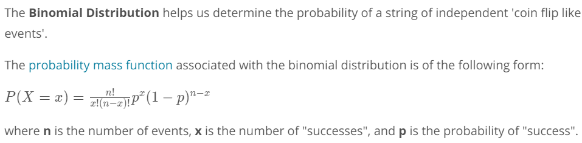

# Probability:
Probability and Statistics are opposite fields but they are related to each other. 
* In proabilty we predict future events based on models and causes that we can assume.
* In statistics we analyse the data from past events to infer those models and causes could be the reasons of that event.
* When finding the probabilities using a continuous distribution, the probability of obtaining an exact value is zero.

## Binomial Distribution:
We can use binomial distribution where events have only two outcomes like head or tail, true or false, yes or no etc.

### NOTE
- The probability of any event must be between 0 and 1, inclusive.
- The probability of the complement event is 1 minus the probability of an event. That is the probability of all other possible events is 1 minus the probability an event itself.
