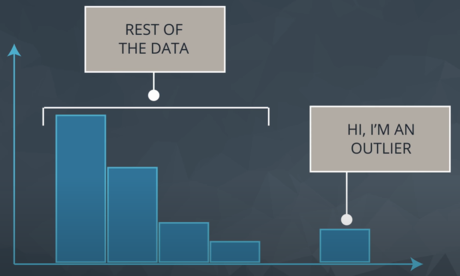

# Statistics
There are two types of statistics. These are - 
* `Descriptive statistics` is about describing our collected data.
* `Inferential Statistics` is about using our collected data to draw conclusions to a larger population.

**Some terms:**

> `Population` - our entire group of interest.

> `Parameter` - numeric summary about a population

> `Sample` - subset of the population

> `Statistic` numeric summary about a sample

## Datatypes:
There are two types of data, Quantitative and Categorical.
* **Quantitative** data takes on numeric values that allow us to perform mathematical operations (like the number of dogs).We can think of quantitative data as being either continuous or discrete.

   * **Continuous data** can be split into smaller and smaller units, and still a smaller unit exists. An example of this is the age of the dog - we can measure the units of the age in years, months, days, hours, seconds, but there are still smaller units that could be associated with the age.

   * **Discrete data** only takes on countable values. The number of dogs we interact with is an example of a discrete data type.

* **Categorical** are used to label a group or set of items (like dog breeds - Collies, Labs, Poodles, etc.).We can divide categorical data further into two types: Ordinal and Nominal.

    * **Categorical Ordinal** data take on a ranked ordering (like a ranked interaction on a scale from Very Poor to Very Good with the dogs).

    * **Categorical Nominal** data do not have an order or ranking (like the breeds of the dog).

### Quantitative vs. Categorical
Some of these can be a bit tricky - notice even though zip codes are a number, they aren’t really a quantitative variable. If we add two zip codes together, we do not obtain any useful information from this new value. Therefore, this is a categorical variable.

Height, Age, the Number of Pages in a Book and Annual Income all take on values that we can add, subtract and perform other operations with to gain useful insight. Hence, these are quantitative.

Gender, Letter Grade, Breakfast Type, Marital Status, and Zip Code can be thought of as labels for a group of items or individuals. Hence, these are categorical.

### Continuous vs. Discrete
To consider if we have continuous or discrete data, we should see if we can split our data into smaller and smaller units. Consider time - we could measure an event in years, months, days, hours, minutes, or seconds, and even at seconds we know there are smaller units we could measure time in. Therefore, we know this data type is continuous. Height, age, and income are all examples of continuous data. Alternatively, the number of pages in a book, dogs I count outside a coffee shop, or trees in a yard are discrete data. We would not want to split our dogs in half.

### Ordinal vs. Nominal
In looking at categorical variables, we found Gender, Marital Status, Zip Code and your Breakfast items are nominal variables where there is no order ranking associated with this type of data. Whether you ate cereal, toast, eggs, or only coffee for breakfast; there is no rank ordering associated with your breakfast.

Alternatively, the Letter Grade or Survey Ratings have a rank ordering associated with it, as ordinal data. If you receive an A, this is higher than an A-. An A- is ranked higher than a B+, and so on... Ordinal variables frequently occur on rating scales from very poor to very good. In many cases we turn these ordinal variables into numbers, as we can more easily analyze them, but more on this later!

### Analyzing Quantitative Data
*  **Four Aspects for Quantitative Data**:
   There are four main aspects to analyzing Quantitative data.

   - Measures of `Center`
   - Measures of `Spread`
   - The `Shape` of the data.
   - `Outliers`
   
### 1. Measures of Center:
There are three measures of center:

  - **Mean** is the average of the values in the dataset.
  - **Median** is the middle most value of the sorted dataset. The median splits our data so that 50% of our values are lower and 50% are higher. In order to compute the median we MUST sort our values first. If we have an odd number of observations, the median is simply the number in the direct middle. If we have an even number of observations, the median is the average of the two values in the middle.
  - **Mode** is the value with higher frequency in the dataset. If all the values in the dataset share the same frequency then there is no mode. On the other hand if two or more values have the highest frequency then there are many modes.

   
### Notation:
Notation is a common language used to communicate mathematical ideas. Think of notation as a universal language used by academic and industry professionals to convey mathematical ideas. Like +, -, /, * , sigma etc. It does have the following properties
1. **Understanding how to correctly use notation makes you seem really smart.** Knowing how to read and write in notation is like learning a new language. A language that is used to convey ideas associated with mathematics.
2. **It allows you to read documentation, and implement an idea to your own problem.** Notation is used to convey how problems are solved all the time. One really popular mathematical algorithm that is used to solve some of the world's most difficult problems is known as Gradient Boosting. The way that it solves problems is explained here: https://en.wikipedia.org/wiki/Gradient_boosting. If you really want to understand how this algorithm works, you need to be able to read and understand notation.
3. **It makes ideas that are hard to say in words easier to convey.** Sometimes we just don't have the right words to say. For those situations, I prefer to use notation to convey the message. Similar to the way an emoji or meme might convey a feeling better than words, notation can convey an idea better than words. Usually those ideas are related to mathematics, but I am not here to stifle your creativity.

### Random Variable:
A random variable is a placeholder for the possible values of some process. Capital Letter is used for random varibles and lowercase letter is used for referencing random variables' values. The subscript of lowercase value signifies the specific value of the random variable. Notation for randomvariable is Uppercase letter.

   
### 2. Measures of Spread:
These are used to provide us an idea of how spread out our data are from one another. Common measures of spread include:

  - **Range** is the value of (max-min) of the dataset.
  - **Interquartile Range (IQR)** is (Q3 -Q1). Q2 is the median of the dataset.
  - **Standard Deviation** is one of the most common measures for talking about the spread of data. It is defined as the average distance of each observation from the mean.
  - **Variance** is the average squared difference of each observation from the mean.
    
#### Calculating the 5 Number Summary:
The five number summary consist of 5 values:

1. **Minimum**: The smallest number in the dataset.
2. **Q1**: The value such that 25% of the data fall below. Q1 is the median of the first part of the dataset according to Q2.
3. **Q2**: The value such that 50% of the data fall below. This is median of the dataset.
4. **Q3**: The value such that 75% of the data fall below. Q3 is the median of the second part of the dataset according to Q2.
5. **Maximum**: The largest value in the dataset.

#### Important Points about SD:
1. The variance is used to compare the spread of two different groups. A set of data with higher variance is more spread out than a dataset with lower variance. Be careful though, there might just be an outlier (or outliers) that is increasing the variance, when most of the data are actually very close.
2. When comparing the spread between two datasets, the units of each must be the same.
3. When data are related to money or the economy, higher variance (or standard deviation) is associated with higher risk.
4. The standard deviation is used more often in practice than the variance, because it shares the units of the original dataset.
5. Using SD or variance we can only talk about specific measures of spread, and not measures of center(like mean or median). Additionally, the range isn't directly associated with the standard deviation. Means, higher SD does not tell higher range.

#### Use of SD in the World:
The standard deviation is associated with risk in finance, assists in determining the significance of drugs in medical studies, and measures the error of our results for predicting anything from the amount of rainfall we can expect tomorrow to your predicted commute time tomorrow.

### 3. The Shape of the data:
Plotting `Histogram` one can visualize the shape of the quantitative data.
### Analyzing Categorical Data:
Analyzing categorical data has fewer parts to consider. Categorical data is analyzed usually be looking at the counts or proportion of individuals that fall into each group. For example if we were looking at the breeds of the dogs, we would care about how many dogs are of each breed, or what proportion of dogs are of each breed type.

### Histogram:
Histogram is the most popular visual for quantitative data. Histograms are super useful to understanding the different aspects of quantitative data - `center`, `spread`, `shape`, `outliers`. From a histogram we can quickly identify the shape of our data. The distribution of our data is frequently associated with one of the three shapes:
> 1. Right-skewed - In which histogram shorter bin in the right side and longer bin in the left side.
> 2. Left-skewed - In which histogram shorter bin in the left side and longer bin in right side.
> 3. Symmetric (frequently normally distributed) - In which histogram right side mirrors the left side.

 

 

 

 

Shape   	| Mean VS. Median  	  | Real World Applications
--------- | ------------------- | ---------------------------------------
Symmetric (Normal) |	Mean = Median = Mode | Height, Weight, Errors, Precipitation
Right-skewed | Mean > Median > Mode |	Amount of drug remaining in a blood stream, Time between phone calls at a call center, Time until light bulb dies
Left-skewed |	Mean < Median < Mode |	Grades as a percentage in many universities, Age of death, Asset price changes

**NOTE:**
* For symmetric distribution `Mean=Median=Mode`. Example - bell curve.
* Histogram is used for depicting quantative data not the categorical data.
* If `Mean=Median` then that always not be Normal distribution that can be symmetric distribution.
* Symmetric distribution is also known as normal distribution and also called as bell curve.  
* Histograms and box plots are both used to plot quantitative data. They cannot be used to plot categorical data.

### Box Plot:
In descriptive statistics, a box plot or boxplot is a method for graphically depicting groups of numerical data through their quartiles. Box plots may also have lines extending from the boxes indicating variability outside the upper and lower quartiles, hence the terms box-and-whisker plot and box-and-whisker diagram. The measures of center and spread we can determine from a Box Plot.

### 4. Outliers:
Outliers are points that fall very far from the rest of our data points. This influences measures like the mean and standard deviation much more than measures associated with the five number summary.

 

 

#### When outliers are present we should consider the following points - 
1. Noting they exist and the impact on summary statistics.
2. If typo - remove or fix
3. Understanding why they exist, and the impact on questions we are trying to answer about our data.
4. Reporting the 5 number summary values is often a better indication than measures like the mean and standard deviation when we have outliers.
5. Be careful in reporting. Know how to ask the right questions.

#### Below are my guidelines for working with any column (random variable) in your dataset.
>1. Plot your data to identify if you have outliers.
>2. Handle outliers accordingly via the methods above.
>3. If no outliers and your data follow a normal distribution - use the mean and standard deviation to describe your dataset, and report that the data are normally distributed.
>4. If you have skewed data or outliers, use the five number summary to summarize your data and report the outliers. Five numbers are min, max, Q1, Q2, Q3.
Outliers have a larger influence on measures like the mean than on measures like the median. We have to work on outliers on a situation basis.

### Descriptive Statistics VS Inferential Statistics
Descriptive statistics is about describing our collected data using the measures: measures of center, measures of spread, shape of our distribution, and outliers. We can also use plots of our data to gain a better understanding. Inferential Statistics is about using our collected data to draw conclusions to a larger population. Performing inferential statistics well requires that we take a sample that accurately represents our population of interest. A common way to collect data is via a survey.
- **Population** - our entire group of interest.
- **Parameter** - numeric summary about a population
- **Sample** - subset of the population
- **Statistic** - numeric summary about a sample

### Simpson's Paradox:
Simpson's paradox, which goes by several names, is a phenomenon in probability and statistics, in which a trend appears in several different groups of data but disappears or reverses when these groups are combined.

### NOTE:
- Histogram is for quantitative variables and its X-axis has quantitative variables and on Y-ais its frequency.
- Whether we use the mean or median to describe a dataset is largely dependent on the shape of our dataset and if there are any outliers.
* The variance is the average squared difference of each observation from the mean.
* `sd` or `var` is used for comparing which dataset spread out more. We cant measure center by these. If `sd1` > `sd2` - this does not imply that `d1` has more range than `d2`.
* Standard deviation of two datasets may be same despite having different maximums.
* Statistic means numeric summeries calculated over the sample dataset.
